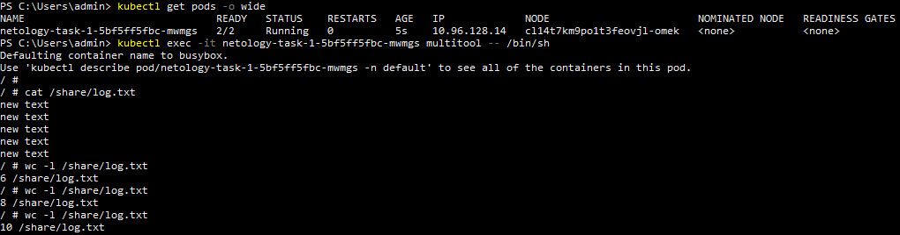
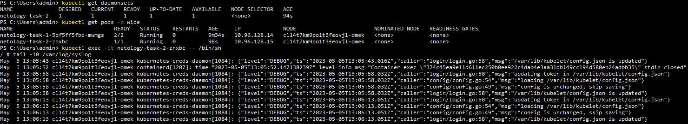

# Домашнее задание к занятию «Хранение в K8s. Часть 1»
1. [Kubernetes manifest файл](./kubernetes%20manifests/deployment.yaml) для деплоймента с multitool и busybox.  
   Запущенный deployment и вывод содержимого файла:  
   
2. [Kubernetes manifest файл](./kubernetes%20manifests/daemonSet.yaml) для даемонсета имеющего доступ к файловой системе хоста.  
   Запущенный daemonSet и вывод последних 10-ти строк файла ```/var/log/syslog```:  
   